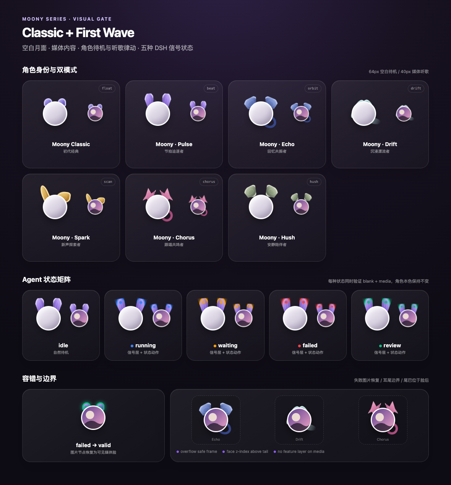

# 🎵 dsh-music · 月宝儿 Moony

> ## 第一款真正意义上的 AI 原生音乐播放器
>
> 不是「能放音乐的 App 套了个 AI 壳」，而是**从出生就住在 AI 里**：
> 它会听你说话、替你找歌、跟你聊歌，还会变成一只陪你听歌的月亮宠物。

---

## 💬 真实的体验

> **不是搜索框，是 DSH 的对话框——像跟朋友说话一样，直接输入你的想法。**

### 体验一：一句话，全集整理好

> 我在对话框里输入：**「我想听任素汐的全部歌」**
>
> 它回答我：

> 🎵 「任素汐的歌单已全部整理好，现在正在播放！
>
> 正在播放：《胡广生》（《无名之辈》插曲，她的成名曲之一）
>
> 播放列表：51 首，列表循环播放，音量 80%
>
> 代表作/热门曲：《胡广生》《王招君》《我要你》（多个版本）、《岁岁》《枕着光的她》《莫怕莫怕》《亲爱的小孩》……
>
> 专辑曲：新专辑《浮尘几章》的《本末》《别来无恙》《张仙语三》《夜灯》……
>
> 影视/现场版：《亲爱的你啊》《大梦 (Live)》《枕着光的她 (春晚版)》《别来无恙 (2026春晚·与毛不易)》……
>
> 合唱：《我要你》（与老狼/墨墨）、《困》（与罗晋）、《有一点动心》（与张信哲）……
>
> 已剔除 28 首伴奏（纯音乐）版本，只保留演唱版；
> 部分歌有多个版本（如《我要你》有 6 个版本、《胡广生》有 3 个版本），都保留了。
> 听的过程中想切歌、暂停或收藏，随时跟我说～ 🎶」

### 体验二：记不清歌名，描述一下就能找到

> 我在对话框里输入：**「大话西游里面很有名的那首歌叫什么来着，不是 only you，是另一首有名的」**
>
> 它回答我：**《一生所爱》——卢冠廷演唱，莫文蔚和声，大话西游最催泪的那首片尾曲。**
>
> （其实它连《Only You》也一起找到了，只是知道你要的是另一首。）

**这种互动、这种信息量、这种情绪价值——传统音乐播放器绝对做不到。**

它不只是播放器，而是**能与你一起讨论歌曲、歌手和音乐本身的 AI 伙伴**。

## ✨ 为什么它是「AI 原生」

| 传统播放器 | 月宝儿 Moony |
| --- | --- |
| 打开 App，在搜索框里输歌名 | 直接在对话框里打字——「我想听任素汐的全部歌」 |
| 搜出来的结果要自己一个个点、自己建歌单 | 一句话，全网搜集、去重整理、剔除伴奏、整单开播 |
| 搜索框只认精确歌名/歌手 | 模糊描述也能找——「大话西游里那首有名的，不是 only you」→ 它知道是《一生所爱》 |
| 搜索条件只能填关键词 | 自然语言随便提——「要安静的」「适合加班的」「任素汐和李宗盛合唱过的」都能理解 |
| 播完就停，歌单要自己维护 | 51 首自动连播，列表循环，想切就切、想收藏就收藏 |
| 冷冰冰的界面 | 一只会跟着音乐律动、会说话、会感知你工作状态的月亮宠物 |
| 装一堆 App、配一堆端口 | 零依赖装完即用，浏览器直接出声 |

- 🚀 **零依赖安装即用**——不需要安装任何音乐播放器，装完就能对话点歌、听歌
- 🎤 **AI 原生体验**——直接在对话框里说「播放 周杰伦」「来点轻松的歌单」「推荐点新歌」，它直接开播，还能听懂「下一首」「暂停」
- 🐰 **月宝儿 Moony 会唱歌**——播放时跟着旋律律动，歌词一句句在气泡里浮现；它还**长着耳朵感知你的 DSH**：蓝色=正在干活、橙色=等你审批、红色=出错、绿色=待审查
- 🧩 **十只 Moony 任你切换**——点「变身」随时换装
- 🖱️ **浮动小窗随叫随到**——右下角悬浮，拖动、折叠、隐藏；播放列表、进度条、收藏、播放模式一应俱全
- 🔒 **本机优先、安全隔离**——音乐服务只监听 127.0.0.1，绝不外泄

## 🚀 30 秒上手

```bash
dsh plugin --profile web add github:Dongfang81/moony-singer
# 重启 dsh web 后，右下角就出现月宝儿了
```

然后，**直接在 DSH 对话框里输入**：

| 你输入 | 它做 |
| --- | --- |
| 「播放 周杰伦 晴天」 | 搜索并立即开播 |
| 「我想听任素汐的全部歌」 | 全网搜集、整理、剔除伴奏、整单开播 |
| 「大话西游里那首有名的，不是 only you」 | 模糊描述也能找到《一生所爱》 |
| 「来点轻松的」 | 随机推荐歌单整单播放 |
| 「下一首」「暂停」「收藏这首」 | 播放控制 / 收藏 |
| 「把某某歌加入播放列表」 | 追加队列，按顺序连播 |

## 🐰 月宝儿 Moony · 宠物 IP

Moony 系列：**圆脸 + 耳朵**。所有宠物共用圆形月面（可装载歌手照片/专辑封面），
身份与情绪由月化耳朵、可选尾巴、耳尖信号灯和听歌律动表达。



- 空闲时圆脸完全留白；播放时圆脸只显示歌手或唱片内容
- 十只角色各有专属耳型、本色与听歌律动节奏
- 圆脸外缘的月相光环显示真实播放进度；暂停定格，缓冲时出现流动缺口
- 展开浮窗点「变身」即可切换，选择本地保存
- 完整 IP 规范见 [docs/IP.md](docs/IP.md)

## 📦 安装与配置

```bash
dsh plugin --profile web add github:Dongfang81/moony-singer
```

可选配置（`cordis.patch.yml`）：

```yaml
- id: alger-music
  name: 'dsh-music'
  config:
    musicApiPort: 30588   # 内置音乐 API 端口
    musicApiHost: '127.0.0.1'
    timeoutMs: 20000
```

## ❓ 常见问题

- **音乐服务未就绪？** 插件加载时自动启动；若端口被占用，改 `musicApiPort` 或重启 dsh web。
- **部分歌曲无法播放？** 版权受限的歌曲没有可用直链，换一首即可。
- **不出声？** 浏览器可能拦截了自动播放，点一下播放按钮即可。
- **不要同时打开多个 DSH 页面**，会重复出声（正常使用只有一个页面）。
- **听歌记忆是什么？** 月宝儿会记住你听过的歌（次数、时长、时段），用于回答「最近常听什么」和深夜推荐舒缓歌单。数据**只存在本机** `~/.dsh/moony-singer-habits.json`，不上传、不跨设备，随时可用 `alger_habits action=clear` 清空。

## 📜 许可与致谢

- 本插件以 **GPL-3.0** 许可发布，见 [LICENSE](./LICENSE)。
- 音乐数据与播放地址来自内置的**开源音乐 API 项目**（MIT 许可），
  上游为 [Binaryify/NeteaseCloudMusicApi](https://github.com/Binaryify/NeteaseCloudMusicApi)（ISC）。
- 仅搜索与播放无版权限制的音乐资源；请遵守你所用音乐平台的服务条款。
